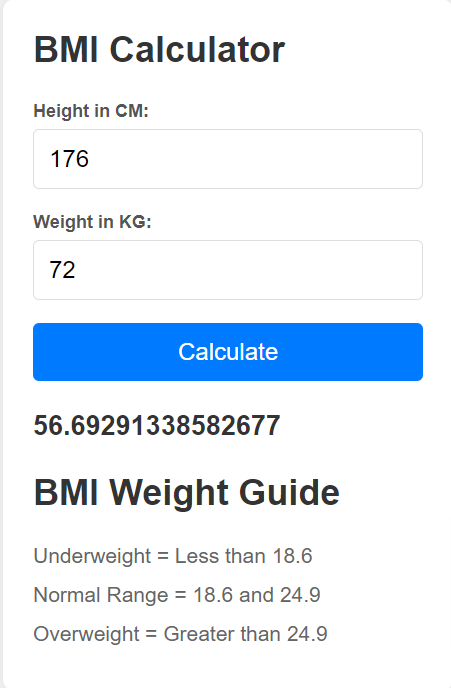

# BMI Calculator

## Description

The BMI Calculator is a simple web application that allows users to calculate their Body Mass Index (BMI) based on their height and weight. This project demonstrates the use of HTML, CSS, and JavaScript for building interactive web applications. It provides immediate feedback on the user's BMI and categorizes it into Underweight, Normal Range, or Overweight based on standard BMI categories.

## Features

- Input fields for height and weight
- Calculation of BMI based on user input
- Display of BMI category
- Responsive design

## Technologies Used

- **HTML**: Markup language for structuring the web page.
- **CSS**: Styles the application to make it visually appealing.
- **JavaScript**: Handles the logic for calculating BMI and validating user input.

## Installation

1. Clone the repository:
    ```bash
    git clone https://github.com/yourusername/bmi-calculator.git
    ```

2. Navigate into the project directory:
    ```bash
    cd bmi-calculator
    ```

3. Open `index.html` in your web browser to view the application.

## Usage

1. Enter your height in centimeters in the "Height in CM" field.
2. Enter your weight in kilograms in the "Weight in KG" field.
3. Click the "Calculate" button to see your BMI and its category.

## Example
* Height in CM: 176
* Weight in KG: 72
* Your BMI is 56.69 (Normal Range)


## Screenshot


